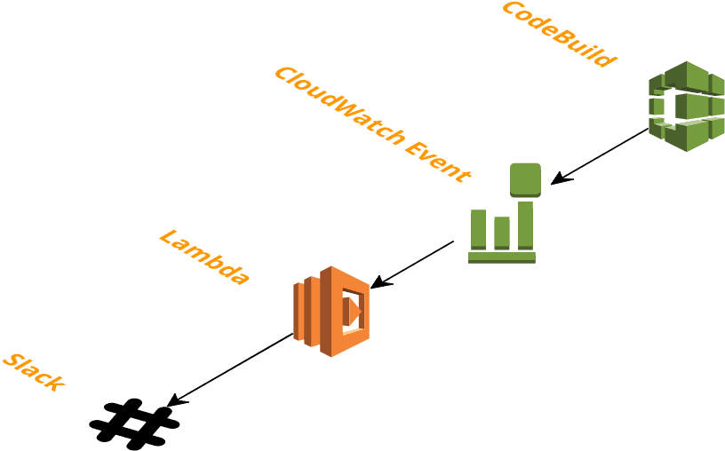

# Conju-gator Slack Notifier

This repository contains resources for sending a Slack notification on build state changes for the Conju-gator frontend code.

### Deployment

The lambda function is written in Go.

To build the lambda:

    make build

To deploy code or infrastructure changes:

    terraform plan

    terraform apply
